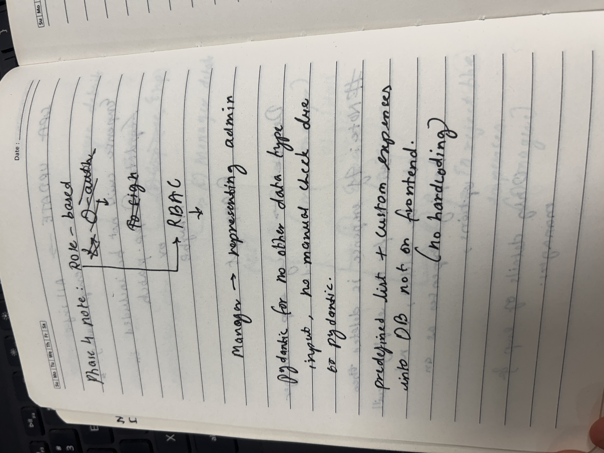
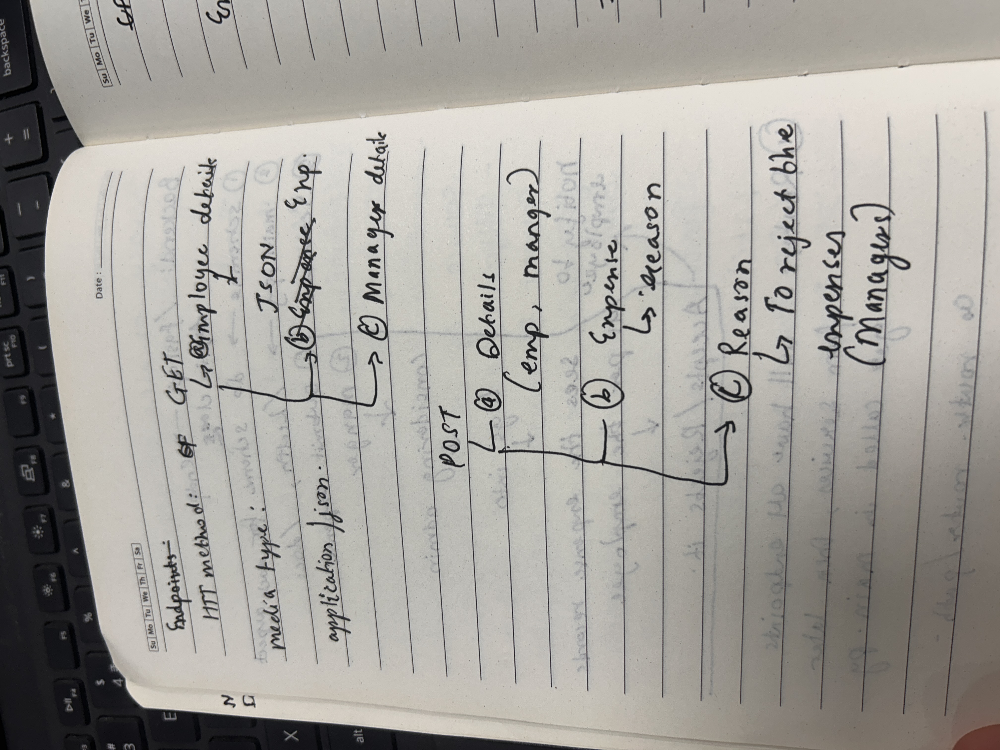
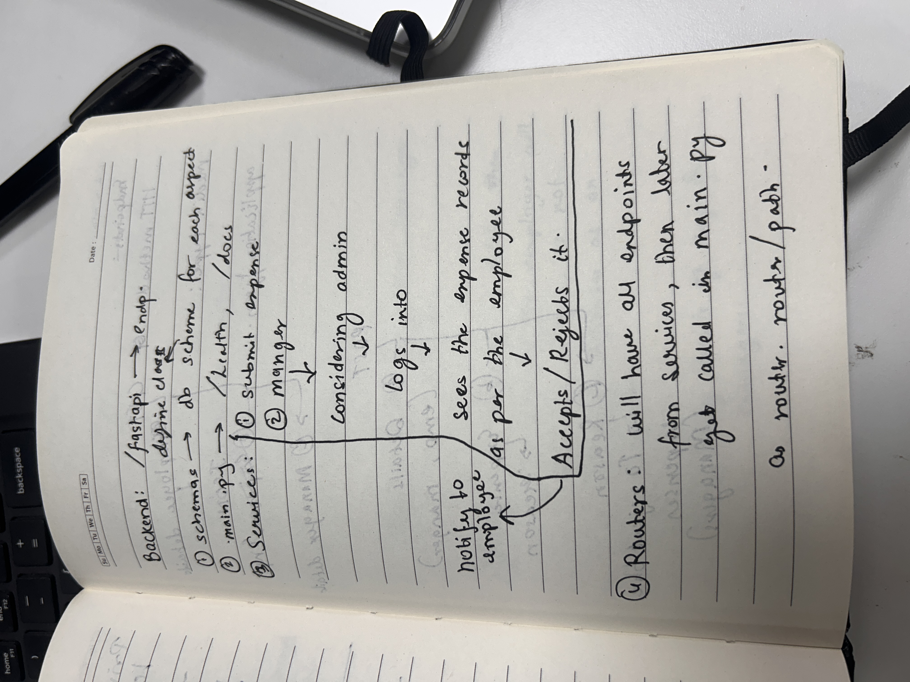
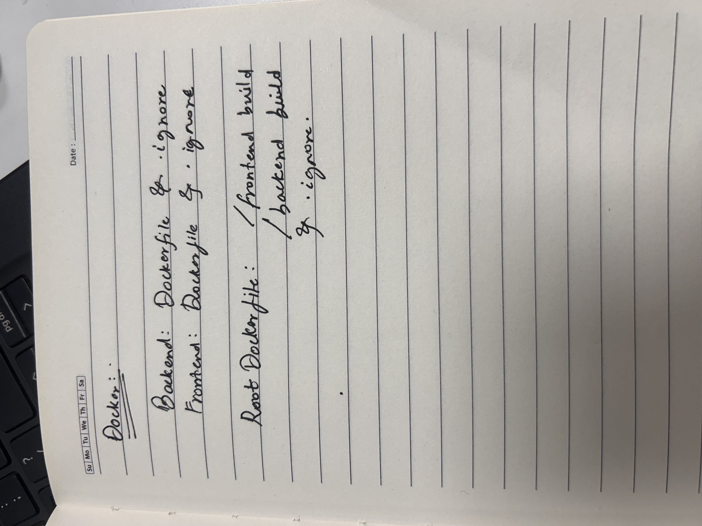

# Employee Expense Tracker

A full-stack application where employees can submit expense requests and a manager can log in to approve or reject them.

Built as part of the Inspira internship task to mirror the architecture used in production products.

---

## Tech Stack

| Layer | Technology |
|---|---|
| Backend | Python 3.12, FastAPI, SQLAlchemy 2.0, Alembic |
| Database | PostgreSQL 16 (Docker) |
| Validation | Pydantic v2, pydantic-settings |
| Auth | JWT (python-jose), bcrypt |
| Frontend | React, Vite, TailwindCSS |
| Container | Docker, Docker Compose |

---

## Project Structure

```
expense-tracker/
├── backend/
│   ├── app/
│   │   ├── features/
│   │   │   ├── auth/          # JWT login
│   │   │   ├── users/         # Employee profiles
│   │   │   ├── categories/    # Expense categories
│   │   │   ├── expenses/      # Expense CRUD + review
│   │   │   └── notifications/ # Employee alerts
│   │   ├── config.py          # Settings from .env
│   │   ├── database.py        # SQLAlchemy engine + Base
│   │   ├── dependencies.py    # DB session, auth guard
│   │   └── main.py            # FastAPI app + CORS
│   ├── migrations/            # Alembic migrations
│   ├── seeds.py               # Predefined categories
│   ├── requirements.txt
│   └── Dockerfile
├── frontend/
│   ├── src/
│   │   ├── components/        # Shared UI components
│   │   ├── pages/             # EmployeeDashboard, ManagerDashboard, ManagerLogin
│   │   ├── services/          # Axios API layer
│   │   ├── context/           # Auth context + JWT state
│   │   └── routes/            # React Router config
│   └── Dockerfile
├── docker-compose.yml
└── .env
```

---

## Getting Started

### Prerequisites

- [Docker Desktop](https://www.docker.com/products/docker-desktop/)
- [Node.js 18+](https://nodejs.org/) (for frontend dev)
- [Python 3.12+](https://www.python.org/) (optional, for running backend locally)

### 1. Clone the repo

```bash
git clone https://github.com/advikdivekar/Inspira-expense-tracker-01-task.git
cd Inspira-expense-tracker-01-task
```

### 2. Create your `.env` file

```bash
cp .env.example .env
```

Edit `.env` with your values:

```env
DB_USER=postgres
DB_PASSWORD=postgres
DB_NAME=expense_tracker
DB_HOST=db
DB_PORT=5432
ADMIN_USERNAME=admin
ADMIN_PASSWORD=admin123
SECRET_KEY=your-secret-key-here
ENVIRONMENT=development
```

### 3. Start the backend with Docker

```bash
docker compose up --build
```

This starts:
- **PostgreSQL** on port `5432`
- **FastAPI** on port `8000` with hot-reload

### 4. Run database migrations

In a second terminal:

```bash
docker compose exec backend alembic upgrade head
```

### 5. Seed predefined categories

```bash
docker compose exec backend python seeds.py
```

### 6. Start the frontend

```bash
cd frontend
npm install
npm run dev
```

Frontend runs at `http://localhost:5173`

---

## API Reference

Interactive docs available at `http://localhost:8000/docs`

### Auth

| Method | Endpoint | Description |
|---|---|---|
| POST | `/api/auth/login` | Manager login, returns JWT |

### Users

| Method | Endpoint | Auth | Description |
|---|---|---|---|
| POST | `/api/users` | Public | Register an employee |
| GET | `/api/users` | Admin | List all employees |
| GET | `/api/users/{id}` | Public | Get employee by ID |

### Categories

| Method | Endpoint | Auth | Description |
|---|---|---|---|
| GET | `/api/categories` | Public | List all categories |

### Expenses

| Method | Endpoint | Auth | Description |
|---|---|---|---|
| POST | `/api/expenses` | Public | Submit an expense |
| GET | `/api/expenses` | Admin | List all expenses (filterable by status) |
| GET | `/api/expenses/user/{id}` | Public | Get expenses for a user |
| PATCH | `/api/expenses/{id}/review` | Admin | Approve or reject an expense |

### Notifications

| Method | Endpoint | Auth | Description |
|---|---|---|---|
| GET | `/api/notifications/user/{id}` | Public | Get notifications for a user |
| GET | `/api/notifications/user/{id}/unread-count` | Public | Get unread count |
| PATCH | `/api/notifications/read` | Public | Mark notification as read |

---

## Features

### Employee
- Register with name and email
- Submit expense requests with amount, reason, and category
- Create custom categories on the fly if predefined ones don't fit
- View own expense history with status (pending / approved / rejected)
- Receive notifications when the manager reviews an expense
- Mark notifications as read

### Manager
- Log in with username and password (JWT-protected)
- View all submitted expenses, filterable by status
- Approve or reject individual expenses
- Provide a rejection reason when rejecting

---

## Development

### Backend only (without Docker)

```bash
cd backend
python -m venv venv
source venv/bin/activate
pip install -r requirements.txt

# Set DB_HOST=localhost in .env first
uvicorn app.main:app --reload
```

### Run migrations manually

```bash
# Generate a new migration after model changes
docker compose exec backend alembic revision --autogenerate -m "description"

# Apply migrations
docker compose exec backend alembic upgrade head

# Rollback one step
docker compose exec backend alembic downgrade -1
```

### Health check

```bash
curl http://localhost:8000/health
# {"status":"ok","environment":"development"}
```

---

## Roadmap

- [x] Phase 1 — Docker + PostgreSQL setup
- [x] Phase 2 — FastAPI backend with full CRUD
- [x] Phase 3 — React frontend with Vite + TailwindCSS
- [x] Phase 4 — Manager authentication + Employee/Manager views + Notifications

---

## Learning Notes

Hand-written planning notes taken while understanding the project requirements and designing the architecture before writing any code.

### Note 1 — Phase 4 Planning: Auth & Categories


> Decided against OAuth, went with role-based access control (RBAC) using JWT.
> Manager account represents the admin — no separate auth model needed.
> Pydantic handles all input validation so no manual type checks in service logic.
> Predefined categories seeded into DB at deploy time, not hardcoded on the frontend — keeps the UI dynamic.

---

### Note 2 — API Design: Update & Delete Behaviour


> `GET` / `UPDATE` endpoints return full info for both employees and managers.
> Expense fields excluded from `PATCH` — only employee/manager profile details are updatable.
> `DELETE` only allowed for employee and manager records.
> Key decision: if an expense is deleted, associated employee records should also cascade delete — so expenses are not exposed as a standalone delete option.

---

### Note 3 — Endpoint Design: HTTP Methods & Payloads


> All endpoints use `application/json` as the media type.
> `GET` flow: employee details → JSON → expense info → manager details.
> `POST` flow: two sets of details (employee + manager) → expense submission with reason → manager uses reason field to reject expenses.

---

### Note 4 — Backend Architecture: FastAPI Structure


> FastAPI app exposes `/health` and `/docs` from `main.py`.
> Three layers per feature: **schemas** (Pydantic validation), **services** (business logic), **routers** (HTTP layer, all registered in `main.py`).
> Manager flow: logs in → views expense records per employee → accepts or rejects → employee gets notified.
> Routers hold all endpoints, call into services, and are mounted in `main.py` with a path prefix.

---

### Note 5 — Docker Structure


> Each service (backend, frontend) has its own `Dockerfile` and `.dockerignore`.
> Root-level `docker-compose.yml` orchestrates both builds — `/frontend` and `/backend` — into a single `docker compose up` command.
